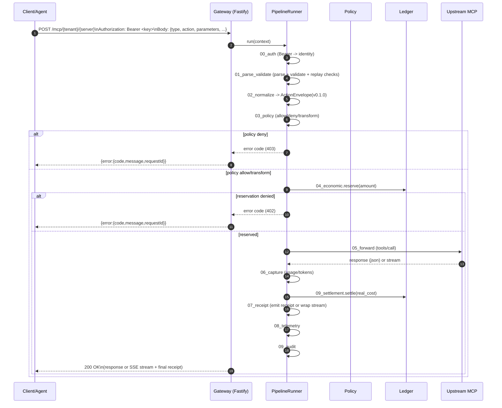
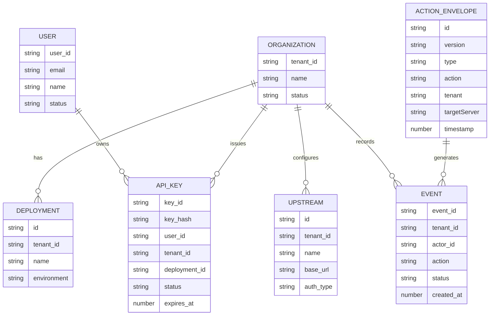

# Auditoría del repositorio MCP para cierre de Fase 0 y tareas pendientes de Fase 1

## Resumen ejecutivo

El repositorio contiene **los artefactos clave de Fase 0** (ActionEnvelope + Proxy API Contract + Error Codes) ya **versionados como v0.1.0** bajo `spec/`, y además existe el **tag `spec-v0.1.0`** (y también `gateway-v0.1.0`) en el historial de tags. citeturn56view0turn56view1turn56view2turn56view3turn18view0

Sin embargo, **Fase 0 no está “binariamente cerrada”** según tu criterio de aceptación, porque **no existe el “diagrama de secuencia de 1 página”** en el repo (se comprueba que no está en el tag `spec-v0.1.0`/ruta esperable). citeturn64view1turn18view0

Para **Fase 1**, el gateway ya implementa un reverse proxy con ruta **`POST /mcp/:tenant/:server`**, autenticación por **`Authorization: Bearer …`**, y un pipeline de interceptores con pasos equivalentes a *parse/validate → normalize(ActionEnvelope) → policy → economic reserve → forward → capture → receipt → telemetry → settlement → audit*, incluyendo lógica de **void** de reservas ante error (patrón tipo saga). citeturn14view2turn15view0turn15view1turn15view2turn16view1turn17view0turn57view0

Lo que impide considerar Fase 1 como “congelada/verde” hoy no es la ausencia de código, sino **deriva de contrato** (spec vs implementación vs docs) y **tests de contrato inconsistentes** con el esquema real de auth/metadata. Además, hay un riesgo crítico de seguridad: **claves privadas y PEMs comprometidos** están commiteados en el root (`keys.json`, `new_keys.json`, `private.pem`, etc.). citeturn35view1turn35view2turn35view3turn35view4

## Metodología y límites de la revisión

La revisión se ha hecho **exclusivamente** sobre el contenido disponible en el repositorio de entity["company","GitHub","code hosting platform"] de entity["people","Jairogelpi","github account"], inspeccionando ficheros por ruta y validando existencia/ausencia (incluyendo lectura en tags). citeturn2view0turn18view0turn64view0turn64view2

Cuando hay discrepancias entre “lo documentado” y “lo implementado”, el informe las trata como **deriva de contrato** (un bloqueador típico para un “Core Contract freeze”), y propone acciones concretas en formato PR. citeturn56view2turn15view1turn61view1

## Evidencia y gaps por dimensión

### Archivos requeridos vs presentes

| Artefacto requerido | Ruta requerida | Estado en repo | Evidencia |
|---|---|---|---|
| ActionEnvelope schema | `spec/action_envelope.schema.json` | Presente (id/version v0.1.0) | citeturn56view0 |
| ActionEnvelope doc | `spec/action_envelope.md` | Presente (v0.1.0) | citeturn56view1 |
| Proxy API Contract | `spec/proxy_api.md` | Presente (v0.1.0) | citeturn56view2 |
| Error codes | `spec/error_codes.md` | Presente (v0.1.0) | citeturn56view3 |
| Diagrama secuencia 1 página | (no fijado, pero “debe existir”) | **Ausente** (404 en ruta esperable en tag) | citeturn64view1 |
| Tag cierre Phase 0 | `spec-v0.1.0` | Presente | citeturn18view0 |

### Diagnóstico por cada dimensión

| Dimensión | Estado actual (archivos/rutas exactas) | Gap vs requisito | Prioridad | Acciones concretas (PRs + comandos) |
|---|---|---:|---|---|
| ActionEnvelope existe y está versionado | `spec/action_envelope.schema.json` define `$id` con `action-envelope.v0.1.0` y requiere `id/version/type/action/parameters/meta` (meta requiere `timestamp/source/tenant/targetServer`). `spec/action_envelope.md` existe y se declara v0.1.0. citeturn56view0turn56view1 | En doc **no se refleja** explícitamente `meta.source` como obligatorio aunque sí en schema. Además, el gateway valida un schema ad-hoc en runtime (no el schema congelado) y exige `request_id/timestamp` en el body, no documentado en `proxy_api.md`. citeturn56view0turn15view1turn56view2 | Media | **PR “spec-errata-v0.1.0”**: añadir `spec/errata.md` (sin tocar v0.1.0) aclarando `meta.source` y el contrato real del body entrante. **PR “gateway-validate-frozen-schema”**: validar el envelope *post-normalize* contra `spec/action_envelope.schema.json` empaquetado. |
| Proxy API contract + error codes | `spec/proxy_api.md` define `POST /mcp/:tenant/:server` y `Authorization: Bearer`. `spec/error_codes.md` define `POLICY_DENY`, `BUDGET_EXCEEDED`, `APPROVAL_REQUIRED`, etc. citeturn56view2turn56view3 | Deriva importante: gateway responde con códigos distintos (ej. `POLICY_VIOLATION`, `BAD_GATEWAY`, etc.), y existe además `spec-public/error_codes.md` con **otra** tabla de códigos de error (duplicidad). citeturn14view2turn60view0turn56view3 | Alta | **PR “spec-contract-unification”**: decidir “fuente de verdad” (`spec/` vs `spec-public/`) y dejar `spec-public/` como artefacto generado o eliminar duplicidad. **PR “gateway-error-code-alignment”**: mapa 1:1 entre errores internos y `spec/error_codes.md`. |
| Rutas y auth del gateway | `gateway/src/server.ts` registra `server.post('/mcp/:tenant/:server', ...)`. La auth está en `gateway/src/interceptors/00_auth.ts` y exige `Authorization: Bearer …`. citeturn14view2turn15view0 | `00_auth` lanza `INVALID_IDENTITY` si no hay identidad; el error handler no lo traduce a `AUTH_INVALID`. Además, varias guías mencionan otra ruta (`/mcp/tools/call`) y header `x-mcp-tenant-id`, creando confusión. citeturn15view0turn14view2turn61view0turn61view1 | Alta | **PR “gateway-auth-contract”**: (a) mapear `INVALID_IDENTITY`→`AUTH_INVALID` y status 401; (b) documentar que el tenant se deriva de la ruta (no de header). **PR “docs-align-proxy-route”**: actualizar `gateway/README.md` y `GUIA_INTEGRACION_UNIVERSAL.md` para usar `/mcp/{tenant}/{server}`. |
| Pipeline del interceptor en gateway | Pipeline se compone en `gateway/src/server.ts` con interceptores: `auth`, `parseValidate`, `normalize`, `ironCage`, `rateLimit`, `policy`, `economic`, `forward`, `capture`, `receiptInteractor`, `telemetry`, `settlement`, `audit`. citeturn14view2turn57view2turn57view1turn16view0turn16view1turn15view3turn16view2turn16view3turn17view0turn57view0 | El pipeline “existe” (y es más completo de lo exigido), pero: (1) `parseValidate` exige replay-metadata (`request_id/timestamp`) no documentada en `proxy_api.md`; (2) rate limit lanza `RATE_LIMIT_EXCEEDED:*` sin mapping estable; (3) hay doble capa de “receipt” (interceptor 07 y además receipt chaining en settlement) sin contrato claro “qué vuelve al cliente”. citeturn15view1turn57view1turn16view2turn17view0 | Alta | **PR “core-contract-pipeline-clarity”**: fijar en spec qué parte es “receipt emit al cliente” y qué parte es “receipt persistida”. Añadir un “receipt_api.md” si aplica (o referenciar contrato existente si ya está congelado por otros tags). |
| Soporte HTTP y SSE | Streaming se activa en `gateway/src/interceptors/05_forward.ts` cuando `envelope.action` contiene `stream` y responde con `Content-Type: text/event-stream` (stub). `07_receipt` inyecta evento `receipt` al final del stream. citeturn15view3turn16view2 | SSE existe pero como **stub** (no hay forward real de un SSE upstream); además no hay contrato en `proxy_api.md` sobre formato SSE/chunks/ids. citeturn15view3turn56view2 | Media | **PR “sse-contract”**: añadir sección en `spec/proxy_api.md` describiendo streaming SSE (headers, formato, evento final de receipt). **PR “sse-pass-through”** (si se requiere): pipear streaming real desde upstream. |
| Tests de contrato (golden/negative/roundtrip) | Existe `tests/contract/package.json` y runner `tests/contract/run_contract_tests.js`. También hay goldens en `tests/contract/goldens/`. Hay runbook que instruye a ejecutarlos. citeturn41view0turn42view0turn43view0turn40view3 | Los tests actuales parecen **incompatibles** con el modelo de IAM y el contrato efectivo: el runner usa `Authorization: Bearer test/admin` mientras el seed crea secretos `admin_secret_123`, `viewer_secret_456` y `demo-key`. Además, el golden `request_valid.json` usa `version: "1.0"` (no SemVer) y no incluye `request_id/timestamp` que exige `parseValidate`. citeturn42view0turn63view1turn15view1turn56view0turn43view0 | Alta | **PR “contract-tests-fix”**: (a) setear tokens reales (`admin_secret_123`, etc.) o usar `key_id` si se decide; (b) actualizar goldens para que representen el contrato vigente; (c) añadir tests snapshot de envelope normalizado (Golden Path de Fase 1). |
| Estructura de repo esperada | Existen `spec/`, `gateway/`, `tests/`, `docs/` y `docs/runbook/README.md`. El SDK está bajo `gateway/sdk/node/...`. citeturn2view0turn40view3turn58view0 | Falta la estructura “cerrada” exacta propuesta (por ejemplo `sdk/` al root, y separación clara `tests/contract/` vs `gateway/test/`). Además hay documentación que referencia ficheros que no existen (`deploy/env.example`, `deploy/docker-compose.prod.yaml`). citeturn61view0turn23view0turn47view1turn47view0 | Media | **PR “repo-layout-hardening”**: mover `gateway/sdk` a `sdk/` o documentar oficialmente la ubicación; alinear Runbook con scripts reales (y borrar referencias rotas). |
| Secretos en repo | Hay material sensible commiteado: `keys.json`, `new_keys.json`, `private.pem`, `public.pem` (contienen claves privadas/PEM). `.gitignore` no los excluye. citeturn35view1turn35view2turn35view3turn35view4turn35view0 | Riesgo crítico: cualquier “firma de receipts” o identidad basada en esas claves está comprometida. Además esto bloquea un “go-live” mínimamente serio. citeturn35view1turn35view3 | Alta | **PR “security-purge-secrets”** + reescritura de historial: `git rm --cached keys.json new_keys.json private.pem public.pem && echo -e "\\nkeys.json\\nnew_keys.json\\n*.pem" >> .gitignore`. Luego `git filter-repo --path keys.json --path new_keys.json --path private.pem --path public.pem --invert-paths` y force-push. Rotación de todas las claves. |
| Front: Org/Keys/Upstreams/Logs + consumo spec/AJV | Front (Next.js) implementa login/register (`/auth/*`), dashboard con selector de orgs y creación de organización vía `/admin/org/create` + listado `/admin/tenants`. No hay dependencias AJV en frontend. citeturn30view0turn31view0turn30view4turn28view0 | No hay pantallas dedicadas para **API Keys**, **Upstreams** y **Logs** (aunque el backend expone endpoints `/admin/api-keys`, `/admin/upstreams`, etc.). Tampoco consume `spec/` ni valida con AJV. citeturn31view0turn54view2turn28view0 | Media | **PR “frontend-golden-path”**: añadir páginas (o secciones) para Keys/Upstreams/Logs usando endpoints existentes; añadir visor de spec (render de markdown) y validación AJV local (añadir `ajv` como dependencia). |
| CI/CD y scripts para tags/spec-v0.1.0 | Existen tags `spec-v0.1.0` y `gateway-v0.1.0` en la lista de tags del repo. citeturn18view0 | No hay evidencia de workflows CI (no existe `.github/workflows/ci.yml`/equivalentes). Además no hay guardarraíl que impida tocar `spec/` sin bump de versión/tag. citeturn34view0turn34view1turn18view0 | Media | **PR “ci-contract-tests”**: agregar GitHub Actions para build gateway + ejecutar `tests/contract`. **PR “spec-immutability-check”**: job que falle si cambia `spec/*.md|*.json` sin cambiar versión/tag (regla simple por diff). |

## Qué falta para cerrar Fase 0

El repositorio ya tiene los artefactos de contrato *mínimos* de Fase 0 en `spec/` y están marcados como v0.1.0; además se taggeó `spec-v0.1.0`. citeturn56view0turn56view1turn56view2turn56view3turn18view0

Lo que **falta** para cumplir el criterio de aceptación “binario” que describiste es:

- **El diagrama de secuencia de 1 página del flujo** no existe en el repo (validado también en el tag `spec-v0.1.0`). citeturn64view1turn18view0  
- Hay **deriva documental** en rutas: `spec/proxy_api.md` fija `POST /mcp/:tenant/:server`, pero guías y README hablan de `POST /mcp/tools/call`. Aunque esto no invalida el contrato congelado, sí invalida la premisa “nadie se confunde con el Core Contract”. citeturn56view2turn61view0turn61view1  
- Existe **duplicidad de códigos de error** con `spec-public/error_codes.md`, que contradice la idea de “fuente de verdad única” para el contract freeze. citeturn60view0turn56view3  

### Diagrama de secuencia propuesto para incorporar al repo

## Backlog concreto para Fase 1

Aunque el gateway ya tiene pipeline, ruta `/mcp/:tenant/:server`, y un set de tests de contrato “tipo runner”, Fase 1 exige **Golden Path verificable**: que cualquiera pueda levantar el entorno y que los tests validen el contrato congelado (ActionEnvelope + Proxy API + errores). citeturn14view2turn40view3turn42view0turn56view2

Las tareas concretas pendientes para considerar Fase 1 “cerrada” (en el sentido de tu checklist) son:

En primer lugar, **alineación contrato ↔ implementación ↔ tests**: `parseValidate` exige `request_id/timestamp` (replay protection) y auth real, pero `spec/proxy_api.md` y los contract tests no lo reflejan de forma consistente. Si esto no se decide, cualquier “freeze” posterior es inestable. citeturn15view1turn56view2turn42view0turn63view1

En segundo lugar, **error codes**: el spec congelado habla de `POLICY_DENY`, `BUDGET_EXCEEDED`, `UPSTREAM_ERROR`, etc. pero el gateway emite otros (`POLICY_VIOLATION`, `BAD_GATEWAY`, códigos derivados de reason codes). Esto rompe consumidores, documentación y tests. citeturn56view3turn14view2turn16view0turn17view0

En tercer lugar, **SSE**: hoy hay streaming “activado por nombre de tool” y receipt injection al final del stream; pero no hay contrato de streaming en `proxy_api.md` ni passthrough real a un upstream SSE (si eso es parte de tu Golden Path). citeturn15view3turn16view2turn56view2

### Entidad-relación mínima propuesta para el sistema

## Seguridad, CI/CD y versionado

Hay un bloqueador de seguridad que **debe tratarse como P0**: claves privadas y material PEM están publicados (`keys.json`, `new_keys.json`, `private.pem`, `public.pem`). Esto no es “deuda”: invalida cualquier afirmación de receipts verificables o un entorno “auditable” si esas claves se usaban o se tomarán como referencia. citeturn35view1turn35view2turn35view3turn35view4

Acción recomendada (concretísima) en una PR dedicada:

- **PR `security/purge-secrets`**  
  - Añadir exclusiones a `.gitignore` (`keys.json`, `new_keys.json`, `*.pem`). Actualmente `.gitignore` no los contempla. citeturn35view0  
  - Quitar del índice y reescribir historial:
    - `git rm --cached keys.json new_keys.json private.pem public.pem`
    - `git commit -m "chore: remove committed secrets"`
    - `git filter-repo --path keys.json --path new_keys.json --path private.pem --path public.pem --invert-paths`
    - `git push --force --all` y `git push --force --tags`
  - Rotar claves y actualizar cualquier seed/config que dependiese de ellas.

En CI/CD: aunque existen tags `spec-v0.1.0` y `gateway-v0.1.0`, no hay evidencia de workflows para ejecutar contract tests o proteger `spec/` contra cambios sin bump. citeturn18view0turn34view0turn34view1

Acción recomendada:

- **PR `ci/contract-tests`**: workflow que haga `docker compose up --build` + ejecute `tests/contract` (según `docs/runbook/README.md`). citeturn40view3turn41view0turn24view0  
- **PR `ci/spec-immutability`**: workflow simple: si `spec/**` cambia, exigir cambio explícito de versión/tag (política mínima para “congelar contrato”).

Finalmente, hay una inconsistencia de versionado que conviene resolver porque degrada la credibilidad del freeze: los README hablan de “v1.0.0”, mientras `gateway/package.json` declara `0.1.0`. Para el contrato, lo importante es `spec-v0.1.0`, pero para producto, esta disonancia genera ambigüedad. citeturn19view3turn14view3turn61view0